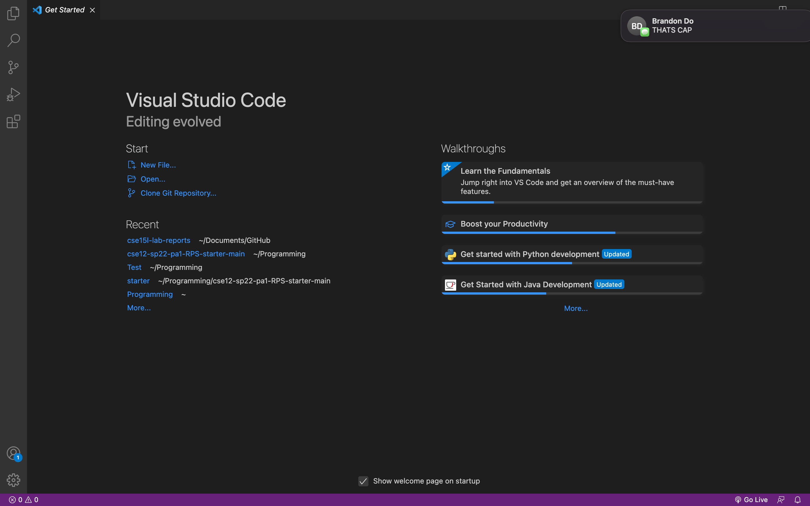
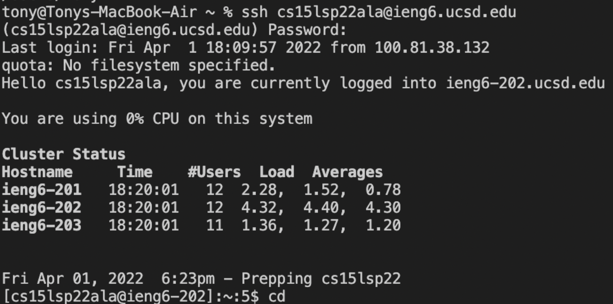
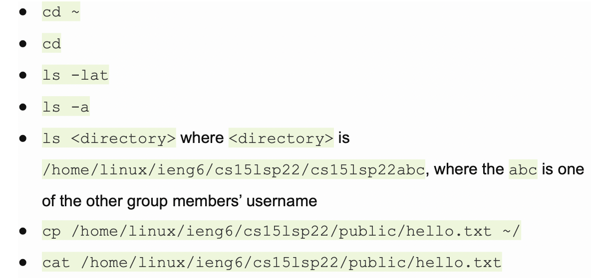
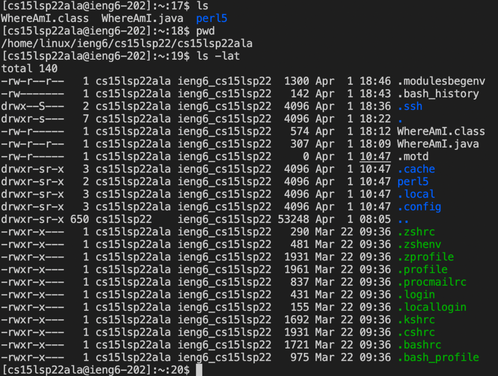
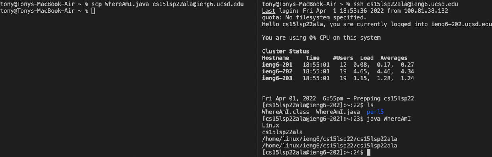
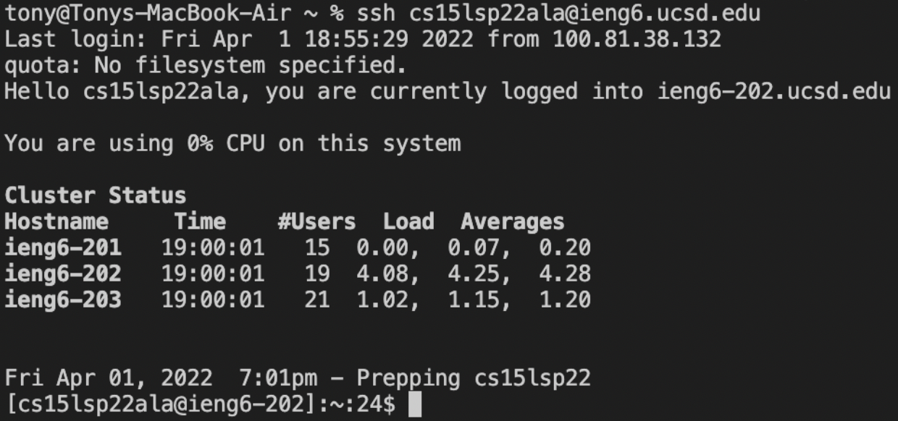
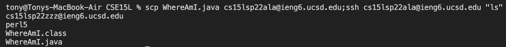

# Lab Report 1 Week 2

Hi to whoever is reading this! My name is Tony Nguyen, and this is my first lab report for CSE15L. In this lab report, I will be guiding you through the various topics:

* Installing VScode
* Remotely Connecting
* Trying Some Commands
* Moving Files with scp
* Setting an SSH Key
* Optimizing Remote Running

## Installing VSCode
Installing VSCode is extremely simple and similar to installing any other thing online. You simply just need to go to the [VSCode Download Page](https://code.visualstudio.com/download) and proceed to go through the steps. Eventually, you should end with this.


## Remotely Connecting
Next, we will move onto remotely connecting to the ieng6 server. In order to start, you will need to open your terminal. Then, all you need to do is use the **ssh** command followed by your account name. Below is an example of what it should look like.


## Trying Some Commands
Now, you can try out some commands that come with ssh. Attached below is a list of possible commands you can use and an example of what your terminal should look like when running commands.

> This a list of possible commands


> This is an example of what your terminal should look like when running commands.

## Moving Files with scp
We will now focus on moving files with **scp** which allows you to transfer files from your local desktop to the remote connection. All you need to do to move files with **scp** is to use the **scp** command followed by the file you want to transfer, and the remote connection that the file will be transferred to. Attached is an example of running the command and showing the file appear on the remote connection.


## Setting an SSH Key
Setting up an SSH key will take the longest out of the previous sections, but it is not any harder.

On the local client (your computer), the commands you run will look like this:
```
ssh-keygen
Generating public/private rsa key pair.
Enter file in which to save the key (/Users/<user-name>/.ssh/id_rsa): /Users/<user-name>/.ssh/id_rsa Enter passphrase (empty for no passphrase): 
```
> Make sure to not add a passphrase

```
Enter same passphrase again: 
Your identification has been saved in /Users/<user-name>/.ssh/id_rsa.
Your public key has been saved in /Users/<user-name>/.ssh/id_rsa.pub.
The key fingerprint is:
SHA256:jZaZH6fI8E2I1D35hnvGeBePQ4ELOf2Ge+G0XknoXp0 <user-name>@<system>.local
The key's randomart image is:
+---[RSA 3072]----+
|                 |
|       . . + .   |
|      . . B o .  |
|     . . B * +.. |
|      o S = *.B. |
|       = = O.*.*+|
|        + * *.BE+|
|           +.+.o |
|             ..  |
+----[SHA256]-----+
```
After successfully setting up your SSH key, you no longer need to use your passphrase to log onto the remote connection with ssh. Attached is an image of what it will look like.

## Optimizing Remote Running
The final part of this report will concern how to run multiple commands in one line in order to lessen the amount of time needed to run commands. There are two concepts that you can use for this:
* After using the ssh command, you can use quotes to immediately execute a line of code after the ssh command.
* Semicolons can be used to run multiple commands on the same terminal line

Attached below is an example of how to use these concepts.

> The example below shows how I used a combination of quotes and semicolons to transfer a file from my local computer to the server, and then list the home directory on the remote server all in one line.