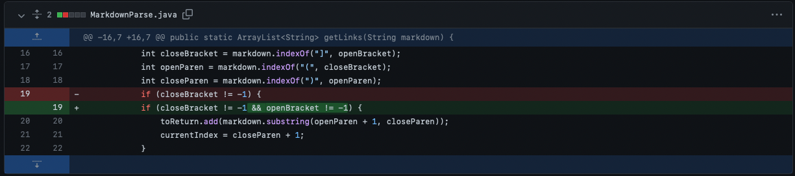
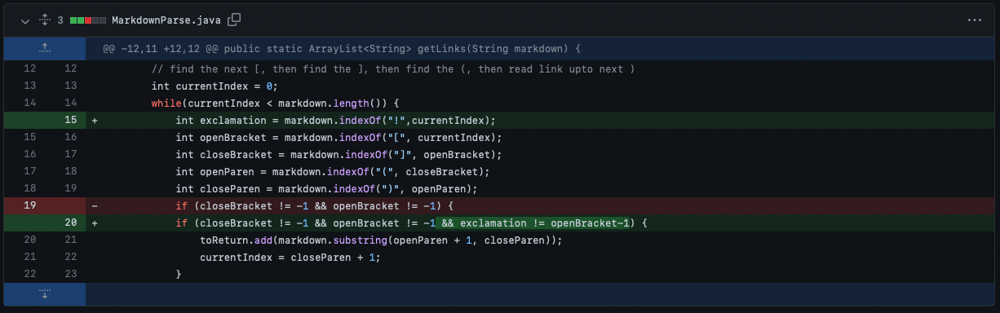
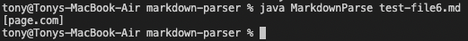
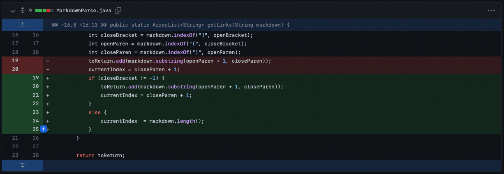
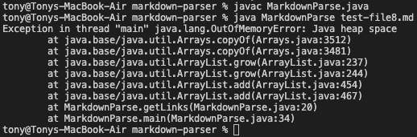

# Lab 2 Week 4

Hi to whoever is reading this! My name is Tony Nguyen, and this is my second lab report for CSE15L. In this lab report, I will be walking through the changes I made to MarkdownParse. This will include the test files that were failure inducing, the symptoms it caused, the bugs that were causing it, and the failure inducing input. The following test files that I will be examining test file [2](test-file2.md), [6](test-file6.md), and [8](test-file8.md). The changes made are in the order of file 8, 6, and then 2.

## [Test File 2](test-file2.md)

> These are the changes I made for test file 2.

> The expected output for test file 2 was an arraylist that contained two links.

The bug that caused the symptom was that since the code did not take into of possible data/content that would be after the last link. This is because there is no open bracket for the program to find, so the close parentheses will never be at the end of file, meaning that the current index won't be at the length of the markdown page, causing the while loop to run indefinitely . Test file 2 has content after its last link which causes the symptom of the code crashing due to running out of memory space.

## [Test File 6](test-file6.md)

> These are the changes I made for test file 6.

> The expected output for test file 6 was an empty arraylist.

The bug that causes the symptom shown above was that the code did not consider the use of images in markdown files. This is because images also have the same markdown format as links, except they include an exclamation point at the beginning. Test file 6 contained an image which made the program think that it was a link and included it in the arraylist, giving the symptom of an unexpected output.

## [Test File 8](test-file8.md)

> These are the changes I made for test file 8.

> The expected output for test file 8 was an arraylist that contained "a link on the first line".

The bug that caused the symptom attached above was that the program would see an open bracket and believe that there was a link present in the file. This would cause it to go in an infinite loop where the program would continously look for a link, even though there wasn't one, and since there was no closing parentheses, the current index would never be equal to the markdown page's length, resulting in an infinite loop. Test file 8 contained just an open bracket which caused the symptom of the program crashing due to running out of memory space.
