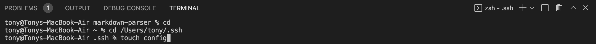
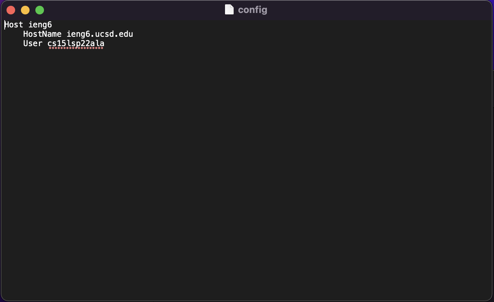
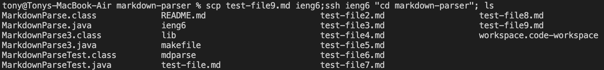
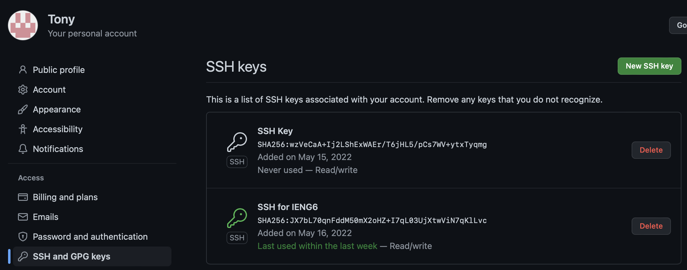
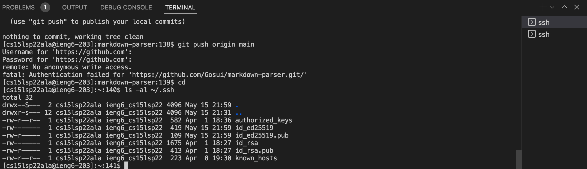
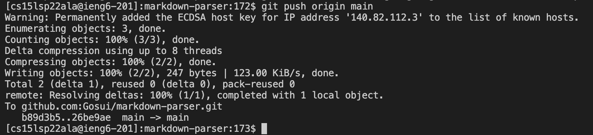
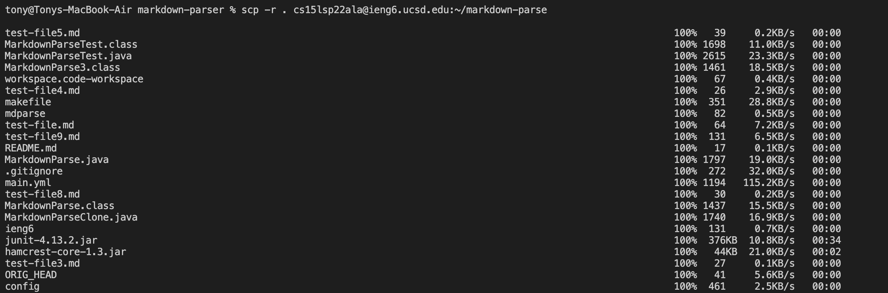
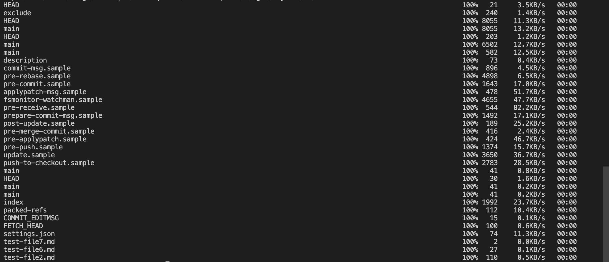
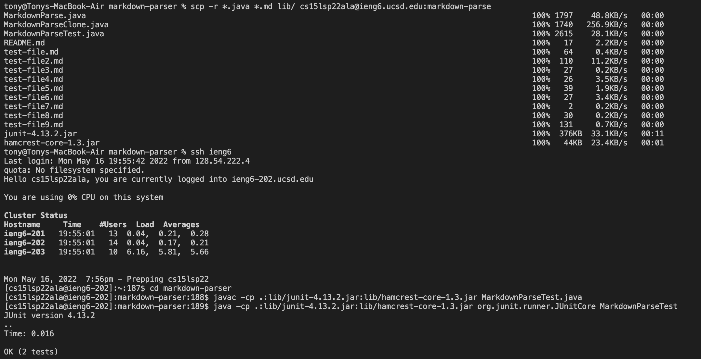
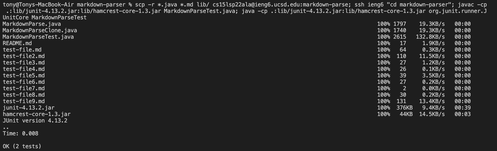

# Lab Report 3 Week 6

Hi to whoever is reading this! My name is Tony Nguyen, and this is my third lab report for CSE15L. In this lab report, I will go over how I implemented all of the Group Choices Options (1-3) from Lab 5. These options include
- Streamlining ssh Configutation
- Setting up GitHub Access from ieng6
- Copying Whole Directories with scp -r

## Streamlining ssh Configuration
In order to connect to the ieng6 account with ssh, it requires the user to memorize their username for logging in. We can simplify this process by putting an entry in ~/.ssh/config. This is done by editing the config file, and if the file is not in the .ssh folder, then you will need to create it. Since I did not have the file beforehand, I used VSCode to add the file through the terminal as shown below.

After creating the file, I added an entry to the config file as shown below.

With this new entry in the config file, I could now just use **ieng6** in place of cs15sp22ala. I demonstrate this with the screenshot below where I copy a file onto the remote server using just **ieng6**, and I use ls to show that the file was successfully moved.

## Setting up Github Access from ieng6
In this section, I will go over how allow ieng6 access to Github which will allow ieng6 to push changes to the main branch. I created a public/private key pair on the ieng6 account and added the public key onto Github. This is seen in the screenshot below.

> The public key stored in Github

> Private/public key pair stored in ieng6

After doing this, I was able to use git commands to push a change onto Github while I was logged into my ieng6 account as shown in the screenshot below.

> Successful git command while logged into ieng6

[This is the link to the commit shown in the screenshot](https://github.com/Gosui/markdown-parser/commit/26be9aed0cbe177132d84d9e102a40b93598397e)

## Copying Whole Directories with scp -r
We can use scp -r to recursively copy the contents of a directory to the remote server. However, we can also have more control over what we want to copy using commands such as *.java and *.md which tell scp to recursively copy files that end in .java or .md. Below is an example of me using scp -r without using the commands to tell scp to selectively copy files.

After doing this, I logged onto my ieng6 account and successfully compiled and ran the tests from my repository as shown in the screenshot below.

I continued by combining all of this onto one line in order to further streamline the process which is seen in the screenshot below.
