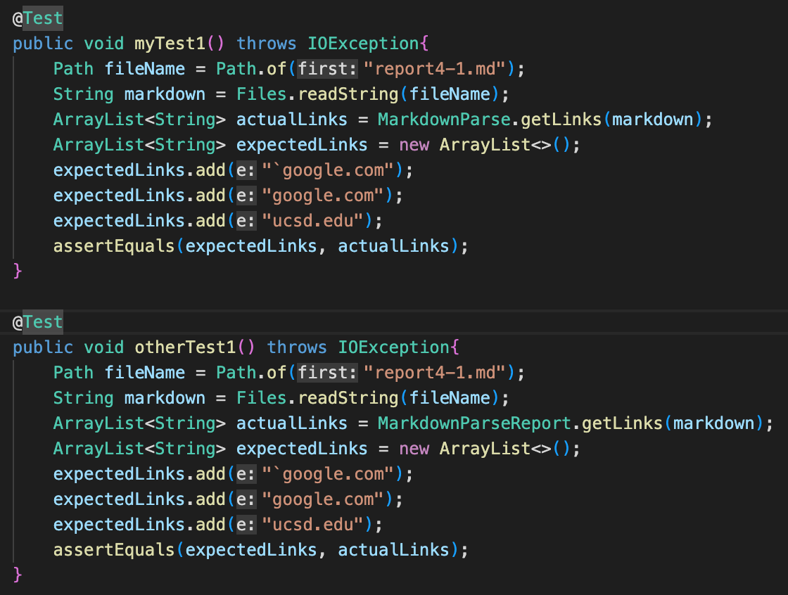
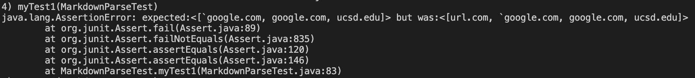
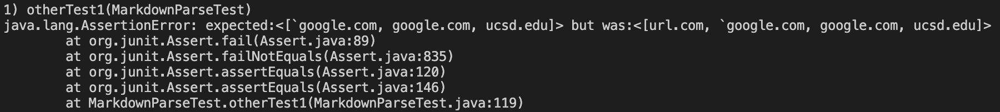
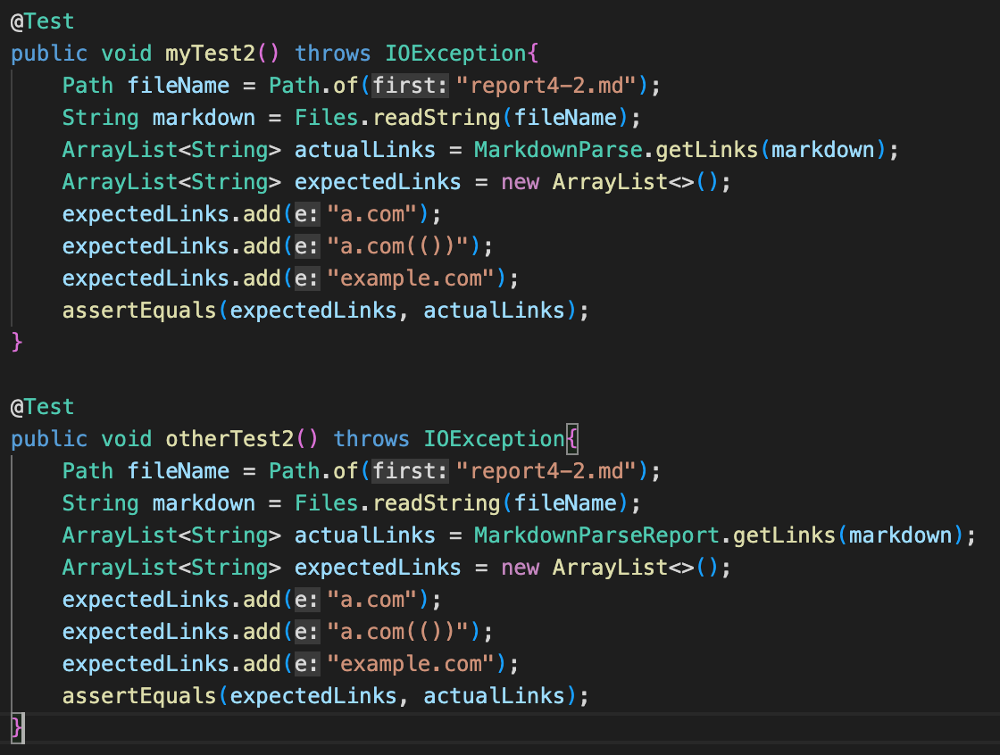
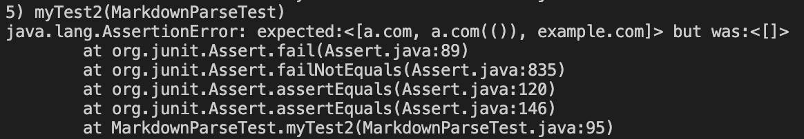
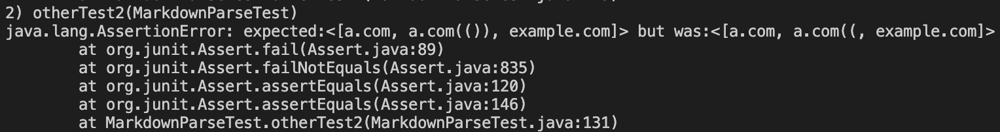
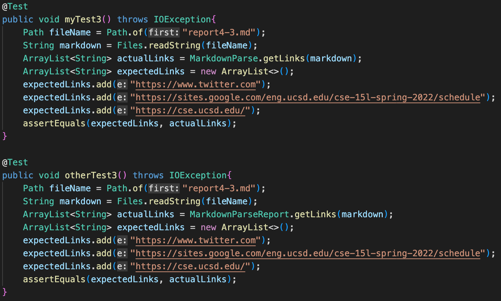
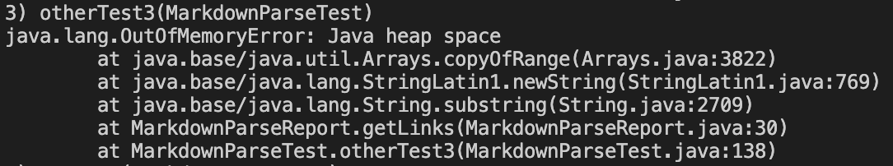

# Lab Report 4 Week 8

Hello to whoever is reading this! My name is Tony Nguyen, and this is my fourth lab report for CSE 15L. In this lab report, I will test my code as well as another CSE 15L group's code with the test-files that are given using Junit.

## Repositories
Attached below are both my repository and the other group's repository.
- [My Repository](https://github.com/Gosui/markdown-parser)
- [Other Group's Repository](https://github.com/FishInAZ/makrdown-parse-own)

## Test Snippet 1

### Expected Output
> [`google.com, google.com, ucsd.edu]

### Code for Testing it

### Test Output for My Code (Failed)

### Test Output for Other Group's Code (Failed)

### Answer to Question in Lab Report
I that there is a small change that would make my program work for snippet 1 and all related cases that use inline code with backticks. This is because my code does not consider backticks. I think in order to update my code for backticks, I would need to create a new way to track for backticks and compare their placement to that of the parentheses and brackets which would take less than 10 lines of code.

## Test Snippet 2

### Expected Output
> [a.com, a.com(()), example.com]

### Code for Testing it

### Test Output for My Code (Failed)

### Test Output for Other Group's Code (Failed)

### Answer to Question in Lab Report
I don't think there is a small change that would allow my program to work properly for snippet 2 and all related cases that include nested parentheses, brackets, and escaped brackets. My code only considers links that are properly formatted without nested parentheses, brackets, and escaped brackets. A change that I think would work is if I used a stack in order to check to see if there is a nested parentheses or bracket, but that would take more than 10 lins of code.

## Test Snippet 3

### Expected Output
> [https://www.twitter.com, https://sites.google.com/eng.ucsd.edu/cse-15l-spring-2022/schedule, https://cse.ucsd.edu/]

### Code for Testing it

### Test Output for My Code (Failed)

### Test Output for Other Group's Code (Failed)

### Answer to Question in Lab Report
I do not think that there is a small change that would allow my program to work for snippet 3 and all related cases that have newlines in brackets and parentheses. This is because my code has only been tested on files that do not have any new lines, so I would need to implement a way to check for new lines within the markdown file. This approach would take more than 10 lines of code because my program does not already consider new lines within a markdown file.