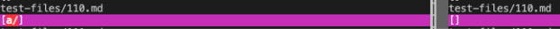
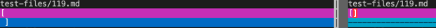
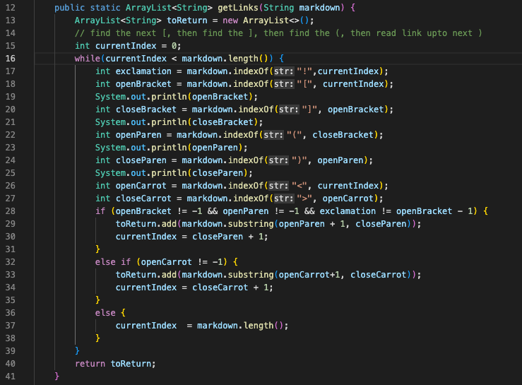
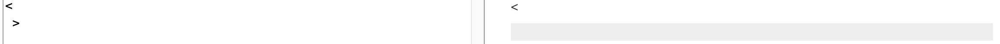

# Lab Report 5 Week 1

Hi to whoever is reading this! My name is Tony Nguyen, and this is my fifth lab report for CSE15L. In this lab report, I will go over two tests for MarkdownParse where my version of MarkdownParse's output did not match the output of the given version MarkdownParse.

## Test Files
I found the tests with different results by using vimdiff. I ran vimdiff and picked two results that were different as shown below.

As seen in the screenshots above, the two test files that had different results were [test file 110](https://github.com/nidhidhamnani/markdown-parser/blob/main/test-files/110.md) and [test file 119](https://github.com/nidhidhamnani/markdown-parser/blob/main/test-files/119.md). In the next sections, I will go over the tests in detail.

## Test File 110

For this test file, the provided implementation was correct while my implementation was not. My output was [a/] while the provided implementation had the proper output which was an empty array, []. This can be seen in the screenshot below of the page opened on the CommonMark demo site as the "links" are not properly formatted, so nothing should be added to the arraylist.

Attached below is my implementation of MarkdownParse. The bug in the code is that it blindly takes whatever is in between the < and > symbols without actually checking if whatever is contained within them is actually a link. A solution could be to check if the thing contained by the symbols is an actual link. This change would occur at lines 26-27 because that is where the code scans for the < and > symbols.

## Test File 119

For this testfile, the provided implementation was correct while my implementation was incorrect. My output was an array that contained a new line while the provided implementation had the correct output of an empty array, []. The screenshot attached below shows the page when it is loaded on the CommonMark demo site, and as it shows, there is no properly formatted link.

Attached below is my implementation of Markdownparse. The bug in my code is that similar to the other file, my code blindly checks to see if there is anything contained between the < and > symbols. Furthermore, it does not check for any new lines that can be contained within the Markdown file which leads to a new line being added to the outputted array. A fix to this bug would be to have code that checks to see if there is a proper link contained between the < and > symbols. This change would occur around lines 26-27 because that is where my program finds the < and > symbols.

